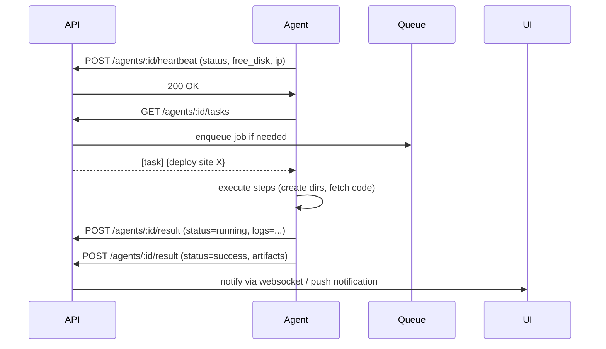

# Custom VPS Control Panel — System Architecture & API Specification

> Draft: complete architecture diagram + server deployment layout + backend API endpoints + agent communication flow

---

## 1. High-level overview

A lightweight control panel composed of three logical layers:

- **Control Panel Frontend** — SPA (React/Angular/Vue) used by admins/customers.
- **Control Panel Backend (API)** — central server (Go) that stores metadata, enqueues tasks, authorizes agents, and exposes REST/GRPC endpoints.
- **Server Agent (Daemon)** — lightweight service (Go) running on each VPS with sudo privileges to perform system tasks (deploy, configure webserver, manage DBs, backup/restore).

Additionally:
- **Storage** for backups (local, S3-compatible, or remote server via rsync)
- **Certificates** (Let's Encrypt via certbot executed by agent)
- **Optional integrations**: DNS providers (Cloudflare), Git hosts (GitHub/GitLab), Object storage

---

## 2. Logical components

1. **UI (Admin / Customer)**
   - Dashboard: servers, sites, backups
   - Site wizard: upload, choose template, provide domain, DB details
   - Database manager
   - Backups & Sync manager
   - Logs & activity

2. **API Server (Control Panel Backend)**
   - Auth (JWT / RBAC)
   - Agent manager (register, heartbeat, keys)
   - Task queue & scheduler
   - Metadata DB (Postgres)
   - File storage API (for temp uploads)

3. **Agent (on VPS)**
   - Receives signed tasks (pull from backend or webhook)
   - Executes sandboxed commands
   - Reports status, logs, and metrics
   - Handles lifecycle: deploy, rollback, backup, restore, db ops

4. **Task Queue / Worker**
   - For long-running tasks (backup, restore, deployment)
   - Could be built-in (Go goroutines + persisted jobs) or use Redis/RabbitMQ

5. **Backup Storage**
   - Local disk or remote (S3-compatible)
   - Metadata stored in control panel DB

---

## 3. Architecture diagram (Mermaid)

```mermaid
graph LR
  subgraph ControlPanel
    UI[Frontend SPA]
    API[Backend API (Go)]
    DB[(Postgres)]
    Queue[(Job Queue)]
    Storage[(Backup Storage/S3)]
  end

  subgraph Network
    Agent1[Agent (VPS A)]
    Agent2[Agent (VPS B)]
    Git[Git Repo / Template Registry]
    DNS[DNS Provider API]
  end

  UI --> API
  API --> DB
  API --> Queue
  API --> Storage
  API -- register/heartbeat --> Agent1
  API -- register/heartbeat --> Agent2
  API -- call DNS API --> DNS
  Agent1 -- fetch templates --> Git
  Agent2 -- fetch templates --> Git
  Queue --> Agent1
  Queue --> Agent2
  Agent1 -- report results --> API
  Agent2 -- report results --> API
```

---

## 4. Server deployment layout (recommended filesystem)

Each managed VPS (agent host) will contain a standardized directory structure. This allows multiple PHP versions, Go binaries, and Node/Next.js apps to coexist.

```
/opt/controlpanel-agent/            # agent binary + config
/opt/apps/                          # root for deployed apps
/opt/apps/{domain}/                 # an app instance
/opt/apps/{domain}/releases/        # release directories (immutable)
/opt/apps/{domain}/current -> releases/{timestamp}
/opt/apps/{domain}/shared/          # storage shared across releases (storage, uploads)
/opt/php/                           # multiple php versions
/opt/php/7.4/bin/php
/opt/php/8.0/bin/php
/opt/php/8.1/bin/php
/opt/php/8.2/bin/php
/opt/go/                            # optional: go binaries or versioned runtimes
/opt/go/1.20/bin/go
/opt/go/binaries/{appname}          # compiled go services managed by systemd
/opt/node/                          # node versions (nvm-like layout)
/var/www/ (optional compatibility)
/var/backups/controlpanel/          # local backup cache
/etc/nginx/sites-available/         # vhost configs
/etc/php/*/fpm/pool.d/              # php-fpm pools per-site
```

**Notes:**
- Use atomic deploys via `releases/{timestamp}` and symlink `current`.
- Use per-site php-fpm pool configured to the appropriate PHP binary socket.
- Provide helper scripts to register/unregister systemd services for Go binaries.

---

## 5. Example server deployment step (detailed)

This is the sequence the **agent** will perform when instructed to deploy a Laravel site (zip upload or git template):

1. Validate input (domain, git/template id, php version, env variables).
2. Create directories:
   - `/opt/apps/example.com/releases/20251109T153000/`
   - `/opt/apps/example.com/shared/`
3. Fetch code (unpack uploaded archive or `git clone --depth=1` template).
4. Set file ownership (www-data or configured user) and permissions on `storage` and `bootstrap/cache`.
5. If PHP app (Laravel):
   - Ensure correct PHP binary exists under `/opt/php/{version}/bin/php`
   - Run composer via that PHP: `/opt/php/8.1/bin/php /usr/local/bin/composer install --no-dev --optimize-autoloader`
   - Copy `.env` (from provided env entries) to release `/.env`
   - Run migrations: `/opt/php/8.1/bin/php artisan migrate --force`
   - Run `artisan key:generate`, `config:cache`, `route:cache`.
6. Configure php-fpm pool (create `/etc/php/{version}/fpm/pool.d/example.com.conf`) and reload php-fpm.
7. Create nginx vhost at `/etc/nginx/sites-available/example.com` and link to `sites-enabled`.
8. Reload nginx.
9. Acquire SSL (Certbot automatic) if domain points to server.
10. Update control panel API with deployment status & final metadata (URL, release id, php version).

On success, the agent writes a `deployment.json` with metadata and the API stores it.

---

## 6. Backend API — Endpoints (REST) (summary)

_All endpoints assume `Authorization: Bearer <JWT>` and RBAC checks._

### Auth
- `POST /api/v1/auth/signin` — body: `{email,password}` → returns JWT
- `POST /api/v1/auth/refresh` — refresh token

### Servers (VPS / Agent Management)
- `GET /api/v1/servers` — list registered servers
- `POST /api/v1/servers` — register a new server (creates agent token)
- `GET /api/v1/servers/:id` — details & last heartbeat
- `DELETE /api/v1/servers/:id` — remove
- `POST /api/v1/servers/:id/actions/reboot` — schedule reboot

### Agents (agent-specific)
- `POST /api/v1/agents/:id/heartbeat` — agent posts status
- `GET /api/v1/agents/:id/tasks` — agent polls tasks (or use websocket)
- `POST /api/v1/agents/:id/result` — agent posts job result/logs

### Sites
- `GET /api/v1/sites` — list sites
- `POST /api/v1/sites` — create new site (body: domain, server_id, template, php_version, env)
- `GET /api/v1/sites/:id` — site details
- `POST /api/v1/sites/:id/deploy` — deploy uploaded archive or trigger template deploy (body: upload_id or template_id)
- `POST /api/v1/sites/:id/rollback` — roll back to previous release
- `POST /api/v1/sites/:id/shutdown` — take down site
- `DELETE /api/v1/sites/:id` — remove site (optionally backup first)

### Databases
- `GET /api/v1/servers/:id/databases` — list DBs on a server
- `POST /api/v1/servers/:id/databases` — create DB (body: name, charset, collation)
- `POST /api/v1/servers/:id/databases/:db/users` — create user and grant privileges
- `POST /api/v1/servers/:id/databases/:db/import` — upload SQL and import
- `POST /api/v1/servers/:id/databases/:db/dump` — create dump (returns backup id)

### Backups
- `GET /api/v1/backups` — list backups
- `POST /api/v1/backups` — create backup (body: sites[], databases[], server_id)
- `POST /api/v1/backups/:id/restore` — restore into target server/site
- `POST /api/v1/backups/:id/transfer` — copy backup to another server/storage

### Templates & Git
- `GET /api/v1/templates` — list available deploy templates
- `POST /api/v1/templates` — add new template (archive or git url)
- `POST /api/v1/sites/:id/deploy-template` — deploy template

### Jobs & Logs
- `GET /api/v1/jobs` — list queued/completed jobs
- `GET /api/v1/jobs/:id/logs` — fetch logs

---

## 7. Agent communication flow

Two supported modes:
1. **Polling (pull)**: Agent polls `GET /api/v1/agents/:id/tasks` regularly.
2. **Push (webhook / websocket)**: API pushes a task to agent over a persistent websocket or via secure webhook tunnel (requires agent-addressable endpoint).

### Recommended: Polling + short-lived WebSocket for live logs



**Security**: Every agent has a long-lived signed token stored in `/etc/controlpanel/agent.key`. Tasks are signed; results are verified by HMAC.

---

## 8. Data models (simplified)

**servers**
```sql
id uuid primary key
name text
ip inet
agent_token text
last_heartbeat timestamptz
meta jsonb
```

**sites**
```sql
id uuid primary key
domain text
server_id uuid references servers(id)
current_release text
php_version text
env jsonb
meta jsonb
created_at timestamptz
```

**jobs**
```sql
id uuid primary key
type text
payload jsonb
status text (queued,running,success,failed)
logs text
created_at timestamptz
started_at timestamptz
finished_at timestamptz
```

**backups**
```sql
id uuid primary key
server_id uuid
sites jsonb
databases jsonb
storage_location text
status text
created_at timestamptz
```

---

## 9. Security considerations

- Use mTLS or signed JWT between API and Agent.
- Limit agent capabilities by running operations through a dedicated system user (e.g., `cpanel-agent`) and escalate only when needed via sudoers rules for specific commands.
- Sanitize uploads; run composer and migrations in controlled env.
- Use per-site php-fpm user or chroot (if required) for additional isolation.
- Rate-limit agent API and admin UI; audit trails for critical actions (deploy, restore, DB drop).

---

## 10. Example: Full "Deploy site" workflow (end-to-end)

1. UI: user clicks **Deploy** → `/api/v1/sites` (POST) created.
2. API: validates request, creates Job `deploy:site:UUID` and persists job record.
3. Queue: job placed in queue targeting `server_id`.
4. Agent: polls and fetches job.
5. Agent: runs steps (fetch code, composer, migrations, vhost config, php-fpm reload, nginx reload, certbot).
6. Agent: streams logs back to API in chunks (`POST /agents/:id/result`), with incremental status updates.
7. API: marks job finished and notifies UI.

---

## 11. Operational & Dev Notes

- **CI/CD**: Provide CI steps to build agent and API images. Prefer static Go binaries for agent for portability.
- **Monitoring**: Integrate Prometheus + Grafana or push metrics to the API.
- **Scaling**: The control panel API is stateless; scale horizontally behind a load balancer. Jobs and queue must be centralized (Redis/RabbitMQ).

---

## 12. Next steps / deliverables I can produce for you

- Sequence diagrams for backup/restore and DB import flows (Mermaid).
- A sample Go-based agent skeleton (systemd service + secure registration).
- API OpenAPI (Swagger) spec for all endpoints.
- Basic React admin UI scaffold with auth.

Tell me which one you want next and I’ll prepare it.

